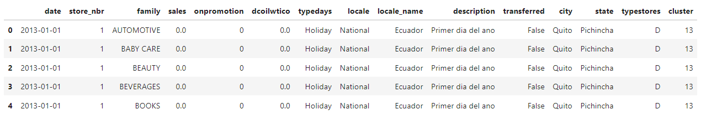
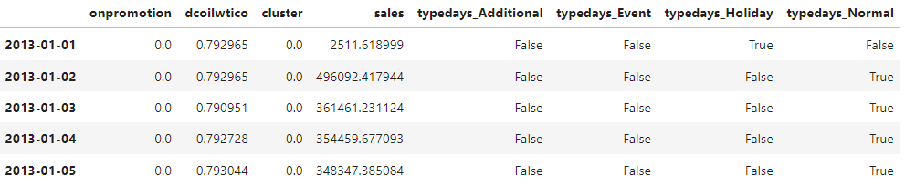
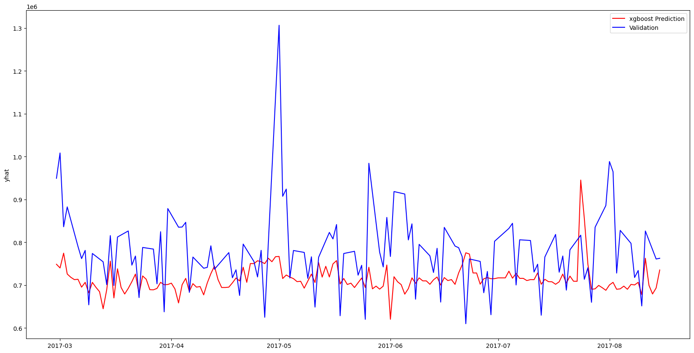
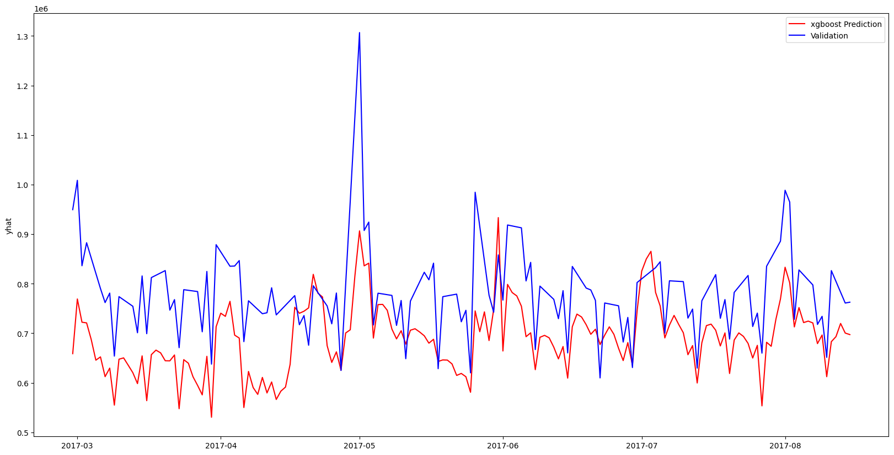
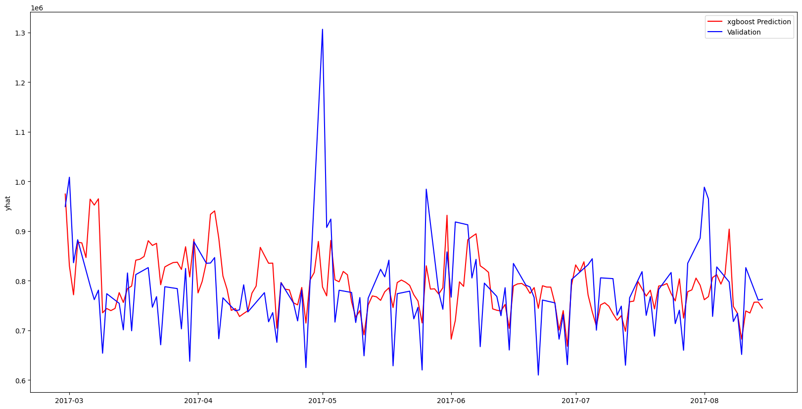
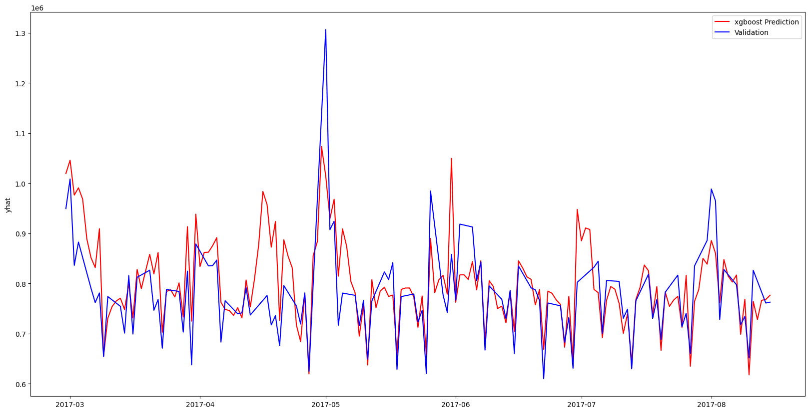
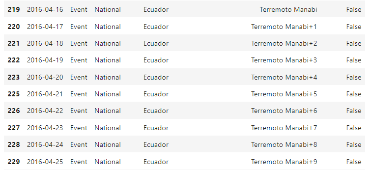
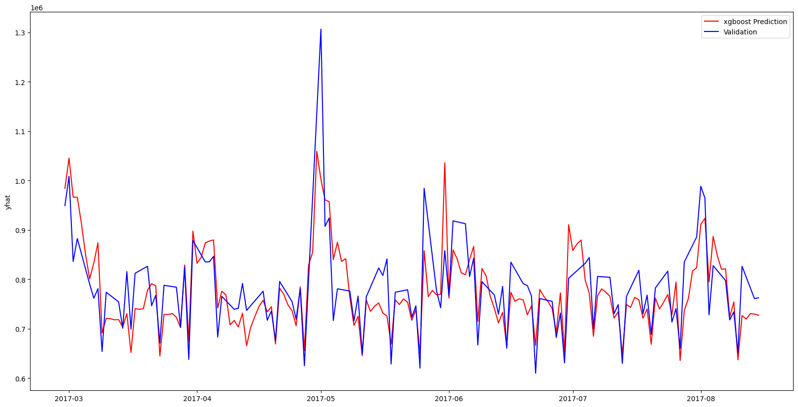
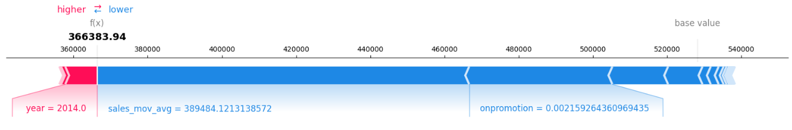
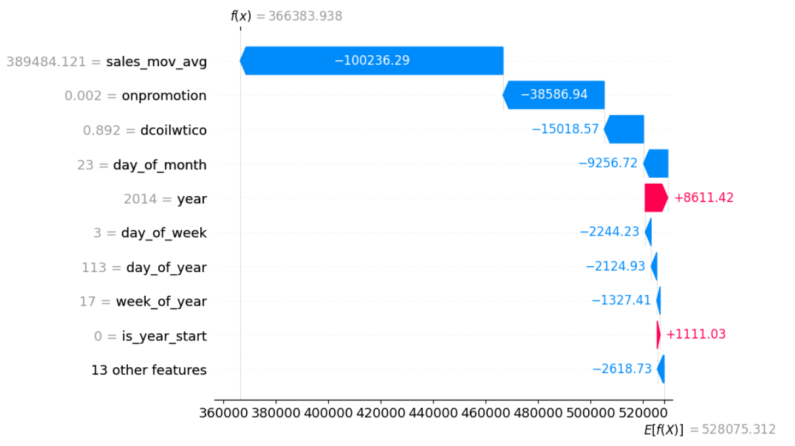

# What factors influence grocery sales in Ecuador?

## Data-centric, Model-centric and Shap Value

In this article, I explore the factors influencing grocery sales in Ecuador by building a Forecasting model with both data-centric and model-centric approch. Then, I will use SHAP values to understand the model output and answer the following question : **What factors influence grocery sales in Ecuador ?**

In the rest of the article, I will:

- Load and process the original data
- Detail the model development steps
- Analyze the insights drawn from the SHAP values

### Data

The dataset is publicly available and can be downloaded from the following link: [stores-sales-time-series-forcasting](https://www.kaggle.com/competitions/store-sales-time-series-forecasting/data)

There are 54 stores and 33 prodcut families in the data. The time serie starts from 2013-01-01 and finishes in 2017-08-31.

There are 4 datasets to help us :

1. **Train :** Contains time series of the stores and the product families combination. The sales column gives the total sales for a product family at a particular store at a given date. Fractional values are possible since products can be sold in fractional units (1.5 kg of cheese, for instance, as opposed to 1 bag of chips). The onpromotion column gives the total number of items in a product family that were being promoted at a store at a given date.
2. **Store :** Gives some information about stores such as city, state, type, cluster.
3. **Holidays and Events :** This data is quite valuable to understand past sales, trend and seasonality components.
4. **Daily Oil Price :** Ecuador is an oil-dependent country and it's economical health is highly vulnerable to shocks in oil prices. That's why, it will help us to understand which product families affected in positive or negative way by oil price.

#### Read and merge the original data

This dataframe provides the number of sales per day of a product family in a given store : `date`, `sales`, `store_nbr`, `family`

We also have these following features :

- `onpromotion` : the number of product in promotion in each store every day
- `dcoilwtico` : oil price per day
- `typedays`, `locale`, `locale_name`, `description`: informations about the day (Is it holidays ? Does a particular event happened this day?)
- `transfered` : A holiday that is transferred officially falls on that calendar day, but was moved to another date by the government
- `city`, `state`, `typestores`, `cluster` : informations about the stores

#### Process the data

We apply a series of operations to our original dataframe :

- Drop possible duplicates
- Interpolate the `dcoilwtico` column due to missing values
- Fix the column `typedays` with the informations provided in the `transfered` column
- Group data by date in order to simplify the modeling phase. As a result, we have the number of sales for each day.
- Remove useless columns which cannot be used as features for the model, ex: `description`, `typestores` (as all stores are now aggregated)
- Normalize data using MinMaxScaler. It ensures that the values are within a fixed range and contributes equally to the analysis.
- Input missing dates
- Use One Hot Encoding to the `typedays` column in order to have usable features for the modeling phase

As a result, we got the following dataframe :

### Sales Forecasting Modeling

#### XGBoost Regressor

XGBoost regressor, in a nutshell, is like a powerful decision tree with multiple layers - imagine stacked trees! It combines the strengths of many weak learners (smaller trees) to create a stronger, more accurate prediction model for continuous values. 

Here's how it works:

1. **Starts with a simple tree :** It builds a basic decision tree based on data, dividing it into groups based on best feature splits.
2. **Adds another tree :** It analyzes the errors made by the first tree and adds another tree focused on improving those predictions.
3. **Keeps learning :** It repeats this process iteratively, adding new trees each time, focusing on correcting previous mistakes and becoming more accurate with each addition.

#### Evaluation process

##### Train Test Split

We devide our data into two sets : Training and Testing. The training set is used to build and refine the model's prediction skills. The testing set remains untouched, providing an unbiased glimpse into the model's real-world performance. For time series data, the Train-Test Split needs to respect the chronological order.

By predicting sales on the testing set, we can calculate how close our model gets to the actual values. We will use RMSE as evaluation metric. The model chosen is the one with the smallest error.

##### Cross validation

For time series data, where the order of data points matters, we can't simply shuffle everything around like a deck of cards for cross-validation. Instead, we use techniques that respect the chronological flow of time. To do so, we will use TimeSeriesSplit. Here, we divide the data into k segments, ensuring they preserve the time order. Then, we train the model on k-1 segments and test on the remaining one, repeating this process for each segment. This allows the model to experience diverse future horizons within the time series, strengthening its ability to forecast unseen sales patterns.

#### Base Model

Using the methodology previously defined and the processed dataframe, we build a first XGBoost Model with the defaults parameters.
The average error on the test set is : $ RMSE = 1.32e10 $

Since this is not really representative, let's visualize the prediction against real data :

As we can see, the model underfit, meaning that it is unable to capture the relationshapship between the inputs and the output. The prediction are almost always below real-world values.

**Let's do better !**

#### Features Engineering

In order to capture seasonality in the model, we create time-related features such as : day of the week, month, season, etc.

The model better capture sales variation despite low base level. To improve that, we add an another feature to the training dataset : a 7-day moving average. It will help the model identify the local trend more effectively.

This addition drastically improved the model and lowered the RMSE to $ 7.19e9 $.

**Now that the model's performance is satisfactory, let's fine-tune it!**

#### Fine-tuning

Now, we will focus on optimize the model hyperparameters with **Bayesian optimization**. The idea is to search for the optimal combination of settings to improve our model.

Instead of randomly trying different options, Bayesian optimization uses past exploration results to guide its search. Think of it as learning from each step, discarding bad paths and focusing on promising ones. This efficient exploration allows it to quickly navigate the complex space of hyperparameters and find the configuration that squeezes the best possible performance out of your model.

The model fits better and better, and the RMSE now equals to $ 4.15e9 $. However, there is a large unexplained period from mid-April to the end of April. Maybe something is missing ?

#### Data Exploration

By digging intot the holidays dataset, we realize that at this time last year, an earthquake happened and had sharply increased the number of sales up to 5 days after it.

We can therefore add a feature to our training dataframe to correct the unexplained portion seen above.

The model has been further improved and the error lowered to $ 3.33e9 $.
We could go on like this to make the model even more powerful, but let's move on the final part.

### Model Explicability

Now that we have a robust model, let's turn to the original question: **What factors influence grocery sales in Ecuador ?**

Here's where model interpretability comes in!

It aims to shed light on the inner workings of a model, revealing how it arrives at its decisions. Think of it like opening the black box, understanding which features contribute most to the predictions and why. This transparency builds trust, helps identify potential biases, and allows for targeted improvements.

#### SHAP

One powerful tool for model interpretability is **SHAP (SHapley Additive exPlanations) values**. Imagine explaining a group project where each member's contribution needs to be clear. SHAP values act like a fair judge, assigning "credit" to each feature based on its individual and combined impact on the prediction. This provides a clear understanding of which features drive high or low sales predictions, empowering you to make informed decisions based on insights, not just blind faith in the model.

In the rest of the article, we calculate the shap values on a subset of the training set.

#### Local interpretability

One of the visualizations we can produce is the force plot. Force plots, like the one shown below, allow you to see how features contributed to the model’s prediction for a specific observation. This is perfect for being able to explain to someone exactly how your model arrived at the prediction it did for a specific observation.

This graph shows the features that contribute to the movement of the model's base value (i.e. the average output). The most important features that push the prediction upwards are shown in red (here, the year). Those who push the prediction backwards are shown in blue (here, the moving average and the lack of promotion are the most importants).

Another way to view this is by using the waterfall function as below :

#### Global interpretabilty